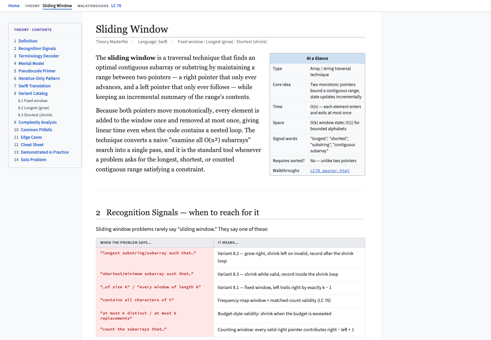

# Swift Interview Lab

Personal LeetCode practice environment in Swift, plus a self-hosted study wiki.

## Study wiki

`wiki/` is a static, Wikipedia-style study wiki. Solving a problem teaches you
that problem; the wiki is where the *pattern* gets distilled so it survives past
the session — theory pages per technique (recognition signals, invariants,
template code, common bugs) and per-problem walkthroughs written as spoken
interview scripts. Pages are plain hand-authored HTML; a zero-dependency
TypeScript engine (no `npm install`, ever) builds the manifest, validates
every page, and serves the site.



Run it locally:

```bash
cd wiki && npm run serve
```

Then open <http://localhost:5050> (zero-install — `npm run` just launches
Node, no `node_modules`). To add a page: `npm run new`, fill in the sections,
then `npm run build && npm run check`. The nav bar and hub index update
automatically from the page's own metadata — no registry to edit. Full
architecture and page formats live in the `wiki` skill (`.claude/skills/wiki/`)
and `wiki/README.md`.

## Commit conventions

Commits follow [Conventional Commits](https://www.conventionalcommits.org/en/v1.0.0/):

```text
<type>(<scope>): <subject>
```

Common types: `feat`, `fix`, `refactor`, `test`, `chore`, `docs`.

## Leetcode problem naming

Each problem follows the same naming pattern:

```text
3_Longest_Substring_Without_Repeating_Characters.swift
```

## Interview-first workflow

Every problem follows a two-file, plan-first structure that mirrors a real interview:

**1. Playground (`Sources/<topic>/LC{n}_Title.swift`)** — the thinking sandbox. Before writing any code, the file opens with a `/* PLAN */` comment block written as the spoken plan you would give an interviewer:

- **Pattern** — why this technique fits ("longest contiguous subarray → sliding window")
- **Condition** — when the window is valid/invalid, and where to record (inside the loop vs. after)
- **State** — every variable you'll need: pointers, counters, accumulators
- *(optional)* **Walk-through** — a mental trace to confirm the logic before touching code
- *(optional)* **Optimizations** — improvements noted once the baseline works

The implementation lives inside `#Playground { }` with `print()` statements kept in — live or commented — as a record of the debugging process.

**2. Test file (`Tests/SwiftInterviewLabTests/<topic>/{n}_Title.swift`)** — the clean, canonical solution. No playground machinery, no prints. This is what gets tested with `swift test`.

The rule: **plan first, code second.** The `/* PLAN */` block is not a comment to fill in later — it is the first thing written, before the function exists.

## Leetcode problems as test files

### 1. Scaffold a problem

Open Claude Code in this repo and run:

```text
/leetcode 3
```

Claude fetches the problem and creates `SwiftInterviewLab/Tests/SwiftInterviewLabTests/3_Longest_Substring_Without_Repeating_Characters.swift`. If LeetCode blocks the request, paste the problem description from the browser.

### 3. Run the tests

```bash
cd SwiftInterviewLab
swift test --filter "3"   # single problem
swift test                # all problems
```